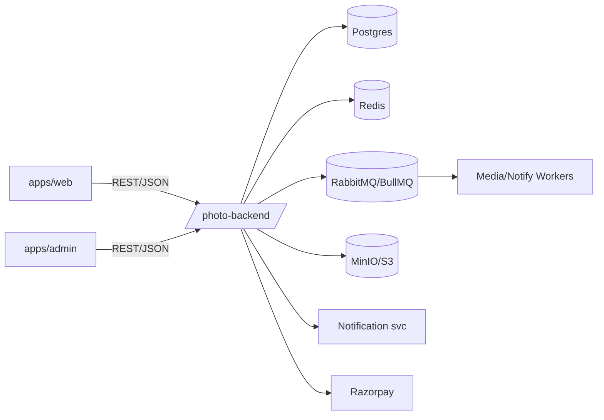

# Photo Platform Monorepo

Apps:
- `photo-backend` (NestJS API)
- `apps/web` (public site)
- `apps/admin` (admin dashboard)

## Run locally
```bash
yarn install
yarn dev:api      # starts Nest API (expects Postgres/Redis/MinIO via docker-compose in photo-backend)
yarn dev:web      # public SPA at :5173
yarn dev:admin    # admin SPA at :5174
```

For full stack with infra:
```bash
cd photo-backend
docker-compose up --build
```

## Env
- Frontend: set `VITE_API_URL`, `VITE_RAZORPAY_KEY_ID` (public key), optional `VITE_MOCK_MODE`.
- Backend secrets: see `photo-backend/src/config/env.validation.ts` // CRITICAL: use AWS Secrets Manager/GCP Secret Manager/Vault, never commit secrets.

## Architecture (simplified)


## Adapters / swaps
- Storage: `StorageModule` uses `S3Adapter` (swap by binding `StorageAdapter`).
- Payments: `PaymentModule` uses `RazorpayAdapter` (add mock adapter for dev or swap provider).
- Notifications: queued processor calling external notification microservice; add mock adapter at `NotificationService.callMicroservice`.
- Rate limiting: `src/main.ts` comment shows where to switch to Redis-backed limiter // CRITICAL: switch to redis-backed limiter here.

## Frontend flows
- Upload: `/images/presign` → PUT file to S3 → `/images` metadata. Fallback multipart direct upload.
- Gallery: cursor pagination via `/images`.
- Checkout: `/payments/create-order` → Razorpay Checkout → `/payments/verify`.
- Contact: POST `/contact` triggers notification event.

## Testing
- Back-end: `yarn workspace photo-backend test` (unit), add e2e under `test/`.
- Front-end: `yarn workspace web test`, `yarn workspace admin test` (Vitest + RTL suggested).

## Notes
- Workers: tune concurrency in `src/modules/worker/workers/media.processor.ts` // CRITICAL: tune concurrency based on instance type.
- Payment verification: `PaymentService.verifySignature` contains idempotency note // CRITICAL: idempotent check - do not process if order already processed.
- Use structured logging (pino) and add Prometheus metrics via Nest Terminus/Prom client when deploying.

